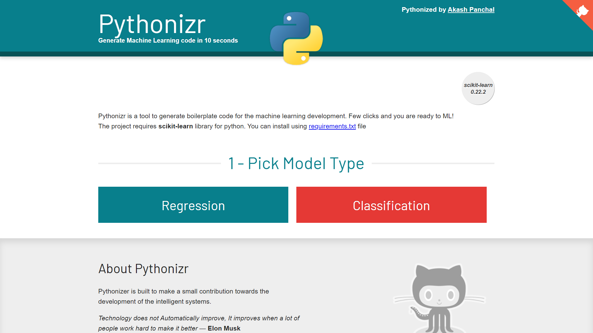

 
# Pythonizr - https://pythonizr.com

* [Motivation](#motivation)
* [Requirements](#requirements)
* [Installation](#installation)
* [Language And Tools](#language-and-tools)
* [Contribution](#contribution)

### Motivation

Motivation behind this project is to reduce the development time for your new project while working on the boilerplate code. 
I've tried to cover most of the possible boilerpalte code files to give you headstart to your next python project.

### Requirements
This project does not require any special tools or libraries. 
A computer, and a web browser of your choice.

### Installation
This is a static HTML website project, no installation requires to run this project. 
Just download or clone it locally and run the `index.html` file.

### Language And Tools
#### HTML

HTML5

#### JavaScript

- Vanilla Javascript
- [jquery](https://jquery.com/)
- [highilighjs](https://highlightjs.org/) for code highlighting
- [highlightjs-badge](https://github.com/RickStrahl/highlightjs-badge)

#### CSS

- Vanilla CSS

-----

## Walkthrough

### 1. Select the Approach

 
### 2. Configure

  
### 3. Code is ready

-----
## Credits

I owe bunch of thanks to the follwoing people
 - [Initializr by Jonathan Verrecchia](http://initializr.com)
 - [Extensionizr by Alex Wolkov](https://extensionizr.com)
 - All the contributors of [highlight.js](https://highlightjs.org/)
 - [highlightjs-badge](https://github.com/RickStrahl/highlightjs-badge) by Rick Strahl
 - Github octocat svg by [Sarah Drasner](https://github.com/sdras)

 
 
